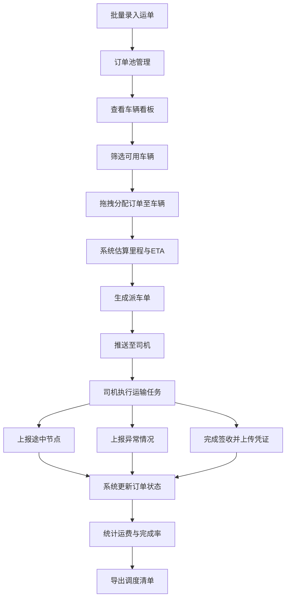

## 1. 产品概述
面向中小物流车队的 Web 调度管理应用，帮助调度员高效完成每日公路货运任务的编排与监控。
- 主要解决调度员人工派单效率低、车辆状态不透明、异常响应慢、运费统计繁琐等问题
- 目标用户为中小物流企业调度员、车队管理者，核心价值是提升调度效率、降低运营成本、提升服务质量

## 2. 核心功能

### 2.1 用户角色
| 角色 | 注册方式 | 核心权限 |
|------|----------|----------|
| 调度员 | 系统账号登录 | 订单管理、车辆调度、线路规划、异常处理、报表查看 |
| 司机 | 系统账号登录 | 查看派车单、上报节点、异常上报、签收上传 |

### 2.2 功能模块
1. **订单池**：运单列表、批量录入、筛选搜索、订单状态管理
2. **车辆看板**：车辆状态展示（空闲/在途/维修）、载重车型筛选、车辆详情
3. **线路规划**：拖拽分配订单、里程估算、预计到达时间计算
4. **司机任务**：派车单生成、装卸地址推送、任务节点记录
5. **异常处理**：拥堵/破损/迟到异常上报、异常处理跟踪
6. **统计报表**：客户/车辆维度汇总、运费统计、完成率分析、调度清单导出

### 2.3 页面详情
| 页面名称 | 模块名称 | 功能描述 |
|----------|----------|----------|
| 订单池 | 订单列表 | 展示所有运单，支持按客户、状态、日期筛选 |
| 订单池 | 批量录入 | Excel/表单批量导入运单，支持字段校验 |
| 订单池 | 订单操作 | 查看详情、编辑、取消订单、标记已分配 |
| 车辆看板 | 状态看板 | 卡片式展示车辆，按空闲/在途/维修分类 |
| 车辆看板 | 筛选过滤 | 按载重、车型、牌照号筛选车辆 |
| 车辆看板 | 车辆详情 | 展示车辆信息、当前任务、历史记录 |
| 线路规划 | 拖拽分配 | 将订单拖拽至车辆，自动生成运输任务 |
| 线路规划 | 路线估算 | 根据起终点估算里程、运输时长、预计到达 |
| 线路规划 | 任务预览 | 预览当日所有车辆的任务安排 |
| 司机任务 | 派车单 | 生成司机派车单，包含装卸地址、联系人、货物信息 |
| 司机任务 | 节点记录 | 司机上报装货完成、途中到达、卸货完成等节点 |
| 司机任务 | 信息推送 | 推送装卸地址、联系人电话至司机端 |
| 异常处理 | 异常上报 | 上报拥堵、破损、迟到等异常，支持文字+图片 |
| 异常处理 | 异常跟踪 | 异常列表、状态跟进、处理记录 |
| 统计报表 | 运费汇总 | 按客户/车辆汇总运费，支持时间范围筛选 |
| 统计报表 | 完成率统计 | 订单完成率、准点率统计 |
| 统计报表 | 数据导出 | 导出当日调度清单为 Excel/CSV |

## 3. 核心流程
调度员每日工作流程：批量录入当日运单 → 查看车辆状态并筛选可用车辆 → 通过拖拽将订单分配给车辆 → 系统估算里程和到达时间 → 生成派车单推送至司机 → 司机运输途中上报节点和异常 → 签收后上传凭证 → 系统自动汇总运费和完成率 → 导出当日调度清单。

## 4. 用户界面设计

### 4.1 设计风格
- **主色调**：深蓝（#1E40AF）作为主色，体现专业可靠；橙色（#F97316）作为强调色，用于重要操作和状态提示
- **辅助色**：绿色（#10B981）表示完成/正常，红色（#EF4444）表示异常/警告，灰色系作为中性色
- **按钮样式**：圆角 8px，主按钮使用深蓝填充，悬停时轻微加深
- **字体**：标题使用思源黑体 Bold，正文使用思源黑体 Regular
- **布局风格**：顶部导航栏 + 左侧菜单 + 主内容区的经典后台布局，卡片式设计承载数据
- **图标风格**：使用 Lucide 线性图标，保持简洁统一

### 4.2 页面设计概览
| 页面名称 | 模块名称 | UI 元素 |
|----------|----------|----------|
| 订单池 | 订单列表 | 数据表格、筛选栏、批量操作按钮、分页组件 |
| 订单池 | 批量录入 | 上传区域、字段映射预览、确认按钮 |
| 车辆看板 | 状态看板 | 三列看板布局（空闲/在途/维修）、车辆卡片、状态标签 |
| 车辆看板 | 筛选过滤 | 下拉筛选器、搜索框、滑块筛选（载重） |
| 线路规划 | 拖拽分配 | 左侧订单列表（可拖拽）、右侧车辆列、拖拽放置区域 |
| 线路规划 | 路线估算 | 地图缩略图、里程显示、时间轴、ETA 信息 |
| 司机任务 | 派车单 | 详情卡片、信息分组展示、打印/导出按钮 |
| 异常处理 | 异常上报 | 表单输入、类型选择器、图片上传、提交按钮 |
| 统计报表 | 数据可视化 | 柱状图（运费）、饼图（完成率）、数据表格 |
| 统计报表 | 数据导出 | 导出按钮、格式选择器、下载提示 |

### 4.3 响应式设计
- 采用桌面端优先设计，主要面向调度员办公场景
- 支持最小宽度 1280px，保证数据表格的可读性
- 关键操作区域保持固定，数据区域支持内部滚动
- 移动端做基础适配，保证司机可在手机查看任务信息

### 4.4 动效与交互
- 页面切换使用 200ms 淡入淡出过渡
- 拖拽操作时显示半透明预览和放置提示
- 卡片悬停时有轻微上浮和阴影加深效果
- 数据加载时显示骨架屏或脉冲动画
- 状态变更时有颜色渐变过渡效果
