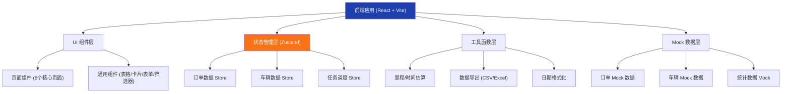
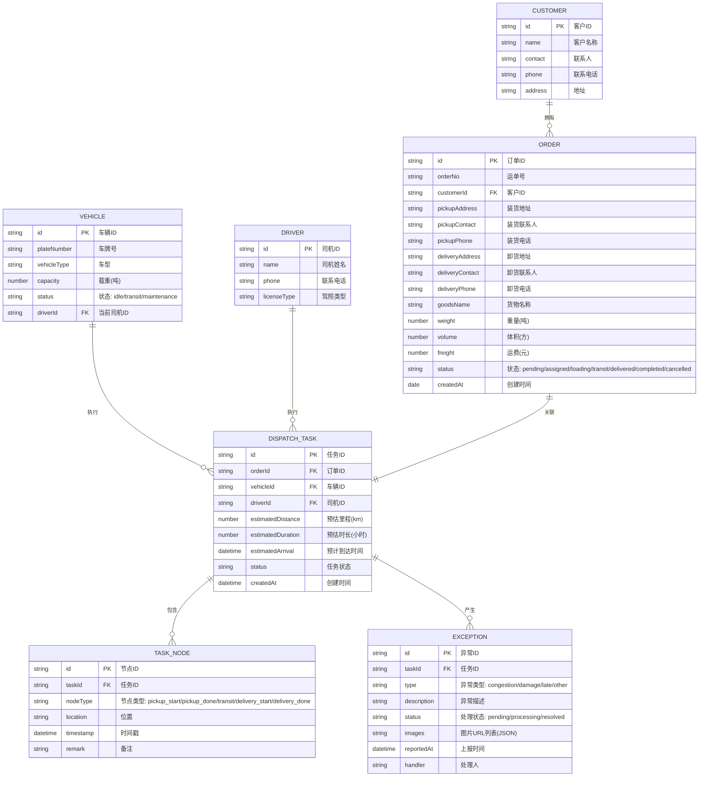

## 1. 架构设计



## 2. 技术说明
- **前端框架**：React@18 + TypeScript
- **构建工具**：Vite
- **样式方案**：TailwindCSS@3
- **状态管理**：Zustand
- **路由**：React Router DOM
- **图标库**：Lucide React
- **拖拽库**：@dnd-kit/core + @dnd-kit/sortable
- **图表库**：Recharts
- **数据导出**：xlsx (SheetJS)
- **后端**：无（纯前端，使用 Mock 数据）
- **初始化工具**：vite-init

## 3. 路由定义
| 路由 | 页面 | 用途 |
|------|------|------|
| / | Dashboard | 系统概览，快捷入口 |
| /orders | 订单池 | 运单管理与批量录入 |
| /vehicles | 车辆看板 | 车辆状态展示与筛选 |
| /dispatch | 线路规划 | 拖拽分配、路线估算 |
| /tasks | 司机任务 | 派车单与任务节点管理 |
| /exceptions | 异常处理 | 异常上报与跟踪 |
| /reports | 统计报表 | 运费汇总、完成率、数据导出 |

## 4. 数据模型

### 4.1 实体关系图



### 4.2 TypeScript 类型定义

```typescript
// 订单类型
export interface Order {
  id: string;
  orderNo: string;
  customerId: string;
  customerName: string;
  pickupAddress: string;
  pickupContact: string;
  pickupPhone: string;
  deliveryAddress: string;
  deliveryContact: string;
  deliveryPhone: string;
  goodsName: string;
  weight: number;
  volume: number;
  freight: number;
  status: OrderStatus;
  createdAt: string;
  taskId?: string;
}

export type OrderStatus = 'pending' | 'assigned' | 'loading' | 'transit' | 'delivered' | 'completed' | 'cancelled';

// 车辆类型
export interface Vehicle {
  id: string;
  plateNumber: string;
  vehicleType: VehicleType;
  capacity: number;
  status: VehicleStatus;
  driverId?: string;
  driverName?: string;
  driverPhone?: string;
  currentLocation?: string;
  nextMaintenanceDate?: string;
}

export type VehicleType = 'van' | 'truck_4_2' | 'truck_6_8' | 'truck_9_6' | 'truck_13' | 'truck_17_5';
export type VehicleStatus = 'idle' | 'transit' | 'maintenance';

// 调度任务类型
export interface DispatchTask {
  id: string;
  orderId: string;
  order: Order;
  vehicleId: string;
  vehicle: Vehicle;
  driverId: string;
  driverName: string;
  driverPhone: string;
  estimatedDistance: number;
  estimatedDuration: number;
  estimatedArrival: string;
  status: TaskStatus;
  nodes: TaskNode[];
  exceptions: ExceptionRecord[];
  createdAt: string;
  proofImageUrl?: string;
}

export type TaskStatus = 'pending' | 'loading' | 'transit' | 'delivering' | 'completed' | 'exception';

// 任务节点
export interface TaskNode {
  id: string;
  taskId: string;
  nodeType: NodeType;
  location: string;
  timestamp: string;
  remark?: string;
}

export type NodeType = 'pickup_start' | 'pickup_done' | 'transit_checkpoint' | 'delivery_start' | 'delivery_done';

// 异常记录
export interface ExceptionRecord {
  id: string;
  taskId: string;
  type: ExceptionType;
  description: string;
  status: ExceptionStatus;
  images: string[];
  reportedAt: string;
  handler?: string;
  handleRemark?: string;
  handledAt?: string;
}

export type ExceptionType = 'congestion' | 'damage' | 'late' | 'other';
export type ExceptionStatus = 'pending' | 'processing' | 'resolved';

// 客户类型
export interface Customer {
  id: string;
  name: string;
  contact: string;
  phone: string;
  address: string;
}

// 统计数据类型
export interface StatisticsData {
  totalOrders: number;
  completedOrders: number;
  totalFreight: number;
  onTimeRate: number;
  exceptionCount: number;
  byCustomer: CustomerStat[];
  byVehicle: VehicleStat[];
}

export interface CustomerStat {
  customerId: string;
  customerName: string;
  orderCount: number;
  completedCount: number;
  totalFreight: number;
  completionRate: number;
}

export interface VehicleStat {
  vehicleId: string;
  plateNumber: string;
  taskCount: number;
  completedCount: number;
  totalDistance: number;
  totalFreight: number;
  completionRate: number;
}
```

## 5. 项目目录结构

```
src/
├── components/          # 通用组件
│   ├── Layout/          # 布局组件
│   │   ├── Sidebar.tsx
│   │   ├── Header.tsx
│   │   └── AppLayout.tsx
│   ├── Order/           # 订单相关组件
│   │   ├── OrderCard.tsx
│   │   ├── OrderTable.tsx
│   │   └── OrderBatchImport.tsx
│   ├── Vehicle/         # 车辆相关组件
│   │   ├── VehicleCard.tsx
│   │   ├── VehicleKanban.tsx
│   │   └── VehicleFilter.tsx
│   ├── Dispatch/        # 调度相关组件
│   │   ├── DraggableOrder.tsx
│   │   ├── VehicleDropZone.tsx
│   │   └── RouteEstimator.tsx
│   ├── Task/            # 任务相关组件
│   │   ├── DispatchSheet.tsx
│   │   └── TaskTimeline.tsx
│   ├── Exception/       # 异常相关组件
│   │   ├── ExceptionForm.tsx
│   │   └── ExceptionList.tsx
│   └── Report/          # 报表相关组件
│       ├── FreightChart.tsx
│       ├── CompletionRateChart.tsx
│       └── ExportButton.tsx
├── pages/               # 页面组件
│   ├── Dashboard.tsx
│   ├── OrderPool.tsx
│   ├── VehicleBoard.tsx
│   ├── RoutePlanning.tsx
│   ├── DriverTasks.tsx
│   ├── ExceptionHandler.tsx
│   └── StatisticsReport.tsx
├── stores/              # Zustand 状态管理
│   ├── orderStore.ts
│   ├── vehicleStore.ts
│   ├── taskStore.ts
│   └── exceptionStore.ts
├── mock/                # Mock 数据
│   ├── orders.ts
│   ├── vehicles.ts
│   ├── tasks.ts
│   ├── customers.ts
│   └── statistics.ts
├── utils/               # 工具函数
│   ├── distance.ts      # 里程估算
│   ├── export.ts        # 数据导出
│   ├── format.ts        # 格式化
│   └── constants.ts     # 常量定义
├── types/               # 类型定义
│   └── index.ts
├── router/              # 路由配置
│   └── index.tsx
├── App.tsx
├── main.tsx
└── index.css
```

## 6. 核心功能实现说明

### 6.1 拖拽分配（线路规划）
- 使用 @dnd-kit/core 实现拖拽功能
- 订单卡片为可拖拽源（Draggable）
- 车辆卡片为放置目标（Droppable）
- 拖拽完成后自动创建调度任务，关联订单与车辆

### 6.2 里程与 ETA 估算
- 基于城市坐标的简化距离计算（Haversine 公式）
- 根据里程和车型平均速度估算运输时长
- 考虑装卸货时间（默认各 1 小时）
- 输出预估里程、时长、预计到达时间

### 6.3 数据导出
- 使用 xlsx 库生成 Excel 文件
- 支持 CSV 和 XLSX 两种格式
- 导出当日所有调度任务及订单信息
- 导出内容包含：运单号、客户、车辆、司机、装卸地址、运费、状态等

### 6.4 状态管理
- 使用 Zustand 管理全局状态
- 订单、车辆、任务、异常分别独立 Store
- 支持跨组件状态共享与更新
- 内置 Mock 数据初始化
